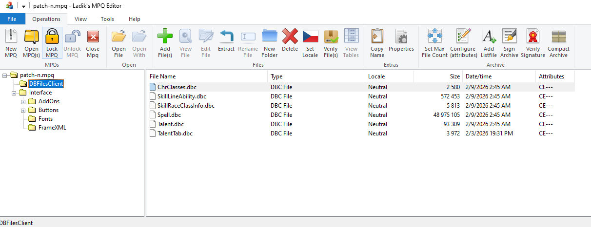

# Classless Wow Module

[English](README.md) | [Español](.github/README_ES.md)

## Introduction

Classless Wrath of the Lich King (3.3.5a) for [Turor/azerothcore-wotlk-classless](https://github.com/Turor/azerothcore-wotlk-classless). It does **not** load on stock AzerothCore: the core fork has the player/talent/action-bar hooks this module calls.

Small-group PvE, no PvP balance. Talent points are player level plus `ClasslessModule.AchievementTalentPoints` × listed achievements (`0` turns that bonus off). `ClasslessModule.Enable` in `conf/classless.conf` turns the module and ClasslessUI off without unloading worldserver.

**GitHub:** [Turor/mod-classless](https://github.com/Turor/mod-classless) (renamed from `ac-classless-wow-module`). Default branch is `master` (what you run). Daily work is `develop`; merge `develop` into `master`, then fast-forward `develop` so both SHAs match. After promoting this module, update the **core** `modules/mod-classless` gitlink to that `master` SHA.

## First-time setup

Preferred path: clone the **core** with submodules (this repo is pulled as `modules/mod-classless` at the recorded SHA). See the [core README](https://github.com/Turor/azerothcore-wotlk-classless#classless-fork-turoran) for CMake, MySQL, and maps.

```bash
git clone --recurse-submodules https://github.com/Turor/azerothcore-wotlk-classless.git
cd azerothcore-wotlk-classless
git checkout master
git submodule update --init --recursive
# ConsolePortLK is private; if that submodule fails:
git -C modules/mod-classless submodule update --init \
  apps/aio apps/transmog apps/teleporter apps/patchgenerator/wow_dbc
```

Then:

1. Build the core with `-DMODULES=static -DLUA_VERSION=luajit` (classless C++ is linked into `worldserver`).
2. Install `conf/classless.conf.dist` → `$PREFIX/etc/modules/classless.conf` with `ClasslessModule.Enable = 1`.
3. Copy Lua into `ALE.ScriptPath` (see **Lua scripts** below).
4. Generate classless DBCs from `apps/patchgenerator/dmls/required/` (gitignored under `UIMods/…/DBFilesClient`), copy them to worldserver `data/dbc/` **and** into the MPQ tree.
5. Pack `patch-n.mpq` (see **Client patch**).
6. Start `authserver` / `worldserver`. Module SQL under `data/sql/db-world/` applies on world startup.

In-game: **N** / **P** or `/classless` (or `.classless`) opens ClasslessUI. After client Lua changes: `/aio reset`.

### Lua scripts

ALE (not stock Eluna) loads `lua_scripts/`. Copy:

| This repo | On the server |
|---|---|
| `apps/aio/AIO_Server/` | `lua_scripts/AIO_Server/` |
| `apps/classless-ui/Catalog.lua` `CatalogData.lua` `ClasslessUIClient.lua` `ClasslessUIServer.lua` `ClasslessResourceBar.lua` `ClasslessResourceBarServer.lua` | `lua_scripts/ClasslessUI/` |
| `apps/teleporter/TeleportSelector/` | `lua_scripts/TeleportSelector/` |
| `apps/transmog/` server Lua | `lua_scripts/Transmogrification/` |

Keep `AIO_Server` on disk so `require("AIO")` works. Nested AIO is [Turor/AIO](https://github.com/Turor/AIO) (includes `/aio reset` init-storm fix). Use the gitlink SHA recorded in this repo; a Rochet2 `master` checkout is not the same tree.

Classless Lua calls extra player methods (`DropTalentRank`, pet talent/autocast, spell-train gold, `GetRuneCooldown`, …). Those bindings live on [Turor/mod-ale](https://github.com/Turor/mod-ale) branch **`classless-acore`**, which is what the classless core gitlink records. Turor/mod-ale `master` tracks newer upstream ALE and does **not** compile against this core.

### Client patch (`patch-n.mpq`)

`UIMods/patch-n/` is the MPQ root (gitignored: generated `DBFilesClient/`, ConsolePort copies). Do **not** pack `apps/classless-ui/legacy/FrameXML/` — the client uses stock 3.3.5 FrameXML; ClasslessUI owns N/P.

Before `mpqcli`:

```bash
# AIO client addon (not tracked under UIMods)
mkdir -p UIMods/patch-n/Interface/AddOns
cp -a apps/aio/AIO_Client UIMods/patch-n/Interface/AddOns/AIO_Client

# Optional pad UI (private Turor/ConsolePortLK)
./scripts/sync-consoleport.sh
```

Pack with a **WotLK** profile so the archive can grow (do not zip a folder and rename it `.mpq`). Quit Wow before replacing a live `Data/patch-n.mpq` (overwriting the open inode causes ERROR #134).

```bash
mpqcli create -g wow-wotlk -o /path/to/patch-n.mpq UIMods/patch-n
```

`ClasslessUIAddons` in the MPQ is **textures only**. The spellbook/talent UI and resource bar are AIO Lua, not a loadable addon. Do not leave a loose `Interface/AddOns/AIO_Client` (or ConsolePort*) tree on the client; it hides the MPQ copy.

Inspect layout with [Ladik's MPQ Editor](http://www.zezula.net/download/mpqeditor_en.zip) vs [.github/ExampleDBCLayout.png](.github/ExampleDBCLayout.png).

### Regenerating DBCs (not needed just to compile C++)

Shipped table dumps are `apps/patchgenerator/dmls/required/*.sql`. First-time you still need extracted 3.3.5 `DBFilesClient` plus Rust/`wow_dbc` to emit `.dbc` files. Automated:

```bash
./install.sh /path/to/extracted/DBFilesClient
```

`install.sh` / `install.ps1` default output paths are Windows-oriented; override `SERVER_DBC_PATH`, `MPQ_OUT_PATH`, `GAME_CLIENT_DATA_PATH`, `MPQ_CLI_PATH`. Prefer `mpqcli create -g wow-wotlk` as above. Flyway and sqlite details follow.

## Creating the dbcs

### Requirements
- [Rust](https://www.rust-lang.org/tools/install)
- [wow_dbc](https://crates.io/crates/wow_dbc)
- [Ladik's MPQ Editor](http://www.zezula.net/download/mpqeditor_en.zip)
- [mpqcli](https://github.com/thegraydot/mpqcli)

### Automatic Installation

Automated scripts are provided to handle the entire installation process, including DBC conversion, SQL patching, DBC generation, and MPQ creation.

**On Windows (PowerShell):**
```powershell
./install.ps1 -DbcInputPath "C:\Path\To\Your\Extracted\DBFilesClient"
```

**On Linux/Unix (Bash):**
```bash
./install.sh /path/to/extracted/DBFilesClient
```

### Creating the SQLite Database

To create a SQLite database from your extracted `.dbc` files, use the `wow_dbc_converter` tool:

1. Open a terminal in `modules/mod-classless/apps/patchgenerator/wow_dbc`.
2. Run the following command:

```powershell
cargo run -p wow_dbc_converter -- wrath -i "C:\Path\To\Your\Extracted\DBFilesClient" -o "wrath_dbcs.sqlite"
```

*   `wrath`: Specifies the game version (use `vanilla` or `burning-crusade` for other versions).
*   `-i`: The input path containing your `.dbc` files (usually the `DBFilesClient` folder).
*   `-o`: The output path for the `.sqlite` file.

### Modifying the Database

My workflow involves using the generated sqlite database to create patches. I then
use sql to create my patches. I have talent update guides for the modifications that
have to be done to the spell file to make the talents work as written. After I modify the
spell table, I export the table to insert statements and name it Spell.sql to convert
using the wow_custom_dbc crate of wow_dbc.

#### The Patching Process

The database modification process follows a structured workflow to ensure all DBC dependencies and talent changes are applied correctly:

1.  **DBC Extraction & Conversion**: Raw `.dbc` files are extracted from the game client and converted into a single SQLite database (`wrath_dbcs.sqlite`) using `wow_dbc_converter`.
2.  **SQL Patch Development**: SQL scripts are written to modify specific tables (like `spell`, `talent`, `talent_tab`, etc.) within the SQLite database.
3.  **Sequential Patching**: Patches are applied in a specific order to maintain data integrity, starting with core requirements and moving to specific talent/spell adjustments.
4.  **DBC Generation**: After applying patches, the modified SQLite tables are exported back to `.dbc` files using `wow_custom_dbc`.
5.  **Client/Server Deployment**: The new `.dbc` files are packed into an MPQ for the client and copied to the server's `dbc` directory.

Note: Increasing mount speed can only be done once and is found in the HighlyOptionalBalanceChanges.sql. Ensure you only execute
those three commented out statements a single time if you are going to increase mount speed.

#### Executing SQL Patches

SQLite patches are versioned Flyway migrations in `apps/patchgenerator/dmls/migrations/` (`V001__…` through `V021__…`). `apply_patches.sh` / `apply_patches.ps1` download the Flyway CLI on first run (into `apps/patchgenerator/.flyway/`, gitignored) and run `flyway migrate` against `wrath_dbcs.sqlite`. Already-applied versions are recorded in `flyway_schema_history` inside that database, so re-running the script is a no-op.

**On Windows (PowerShell):**
```powershell
./apply_patches.ps1 -SqliteDb "./wow_dbc/wrath_dbcs.sqlite"
```

**On Linux/Unix (Bash):**
```bash
./apply_patches.sh
```

New DBC-sqlite changes belong in `dmls/migrations/` as the next `Vnnn__Description.sql`. Do not add unordered files under `spellchangeguides/` / `talentchangeguides/` and expect them to run.

`dmls/required/*.sql` are full-table dumps consumed by `wow_custom_dbc` when generating `.dbc` files. They are not Flyway migrations (re-inserting them into a populated converter database would collide on primary keys).

The numbered migration order matches the previous patch sequence:
1.  Spell change guides (`V001`–`V004`)
2.  Stat file modifications (`V005`–`V006`)
3.  Talent update guides (`V007`–`V017`)
4.  Custom talents (`V018`–`V020`)
5.  Skill race/class info (`V021`)

### Updating skills (classless SkillLine / SkillLineAbility / SkillRaceClassInfo)

Classless play needs every non-racial, non-language, non-pet skill available to every class. That is a **client DBC** change plus a **world DB** change. Talent trees are a separate pass (`dmls/talentchangeguides/`); this section is only skills.

#### Client tables (SQLite → DBC)

Work in `wrath_dbcs.sqlite` after conversion. The tables that matter:

| Table | Role |
|---|---|
| `SkillLine` | Skill definition and `SkillLineCategory` (Class Skills, Languages, Weapon Skills, …). Rarely edited. |
| `SkillLineAbility` | Which spell is granted by a skill, and which `class_mask` / `race_mask` may learn it. |
| `SkillRaceClassInfo` | Whether a class/race combination may *have* the skill at all (`flags`, `class_mask`, `race_mask`, language skill tiers). |
| `ChrClasses` | Class row used by the client (every class uses `display_power = 127` in this module). |

`class_mask = 2047` (`0x7FF`) is all eleven WotLK classes. `race_mask` / `class_mask = -1` means “any”. Do **not** open racials, languages, or pet skills to every class.

Typical SkillLineAbility patch (from `dmls/UsefulQueries.md`):

```sql
UPDATE SkillLineAbility
SET class_mask = 2047
WHERE id IN (
    SELECT SkillLineAbility.id
    FROM SkillLineAbility
    JOIN SkillLine ON SkillLine.id = skill_line
    JOIN SkillLineCategory ON SkillLine.category_id = SkillLineCategory.id
    WHERE SkillLine.display_name_lang_en_gb NOT LIKE '%Racial%'
      AND SkillLine.display_name_lang_en_gb NOT LIKE '%Language%'
      AND SkillLine.display_name_lang_en_gb NOT LIKE '%Pet%'
);
```

SkillRaceClassInfo flags used here:

- **1040** — class skills (shown / usable as class skills for every class).
- **128** — languages (keep language skills language-shaped; they still need two rows per language: skill tier `0` and skill tier `21`).

The current SkillRaceClassInfo edits live in Flyway `V021__SkillRaceClassInfoUpdateGuide.sql` (source notes: `dmls/SkillRaceClassInfoUpdateGuide.sql`).

#### Process

1. Convert extracted `DBFilesClient` to `wrath_dbcs.sqlite` (`wow_dbc_converter`).
2. Inspect with the SELECTs in `SkillRaceClassInfoUpdateGuide.sql` / `UsefulQueries.md` until the masks and flags look right.
3. Put **new** mutating SQL in `dmls/migrations/Vnnn__….sql` and run `./apply_patches.sh` (or `.ps1`). Do not re-edit an already-applied `V0xx` file; Flyway will checksum-fail. Add `V022` (or later) instead.
4. Export the patched tables to INSERT dumps that `wow_custom_dbc` consumes. File stem **must** match the DBC table name:

   - `dmls/required/SkillLineAbility.sql`
   - `dmls/required/SkillRaceClassInfo.sql`
   - `dmls/required/ChrClasses.sql` (if class rows changed)

   `wow_custom_dbc` creates the table from the converter schema, then runs those INSERTs. It does not read Flyway history.
5. Generate DBCs and deploy (next section): `SkillLineAbility.dbc`, `SkillRaceClassInfo.dbc`, and `ChrClasses.dbc` go into `UIMods/patch-n/DBFilesClient` and the worldserver `dbc` directory, then into `patch-n.mpq`.

`dmls/required/*.sql` are the shipped snapshots of those tables, not incremental patches. After you change sqlite, replace the dump for every table you touched.

#### Server world DB (starting skills)

DBC changes let the client *show* and *train* skills. Characters still need rows in `acore_world.playercreateinfo_skills` or they log in without the skill.

That lives in `data/sql/db-world/update_starting_skills.sql` (AzerothCore module SQL, not Flyway/sqlite):

- Set `classMask = 2047` and `raceMask = 1791` on non-racial, non-language starting skills.
- Insert any missing weapon skills (for example fist weapons, skill `473`).
- Languages stay special (`skill` 98 Orcish / 109 Common): widen `raceMask` if needed, do not treat them like class skills.

Apply with the rest of the module’s `data/sql/db-world/` on the world database. Existing characters keep `acore_characters.character_skills`; only new characters pick up `playercreateinfo_skills`.

### Outputting Generated DBCs to UIMods and Worldserver

To use the generated DBCs in a client-side patch and for the server, copy them to the `UIMods/patch-n/DBFilesClient` directory and the worldserver `dbc` directory. This is often part of a larger build process:

```powershell
# Generate DBCs
cargo run -p wow_custom_dbc -- wrath -o "D:\CustomWowRebuild\patchn-new\gen" -i "D:\CustomWowRebuild\azerothcore-wotlk-classless\modules\mod-classless\apps\patchgenerator\dmls\required"

# Copy to UIMods for MPQ creation
copy /y "D:\CustomWowRebuild\patchn-new\gen\dbc" "D:\CustomWowRebuild\azerothcore-wotlk-classless\modules\mod-classless\UIMods\patch-n\DBFilesClient"

# Copy to worldserver location
copy /y "D:\CustomWowRebuild\patchn-new\gen\dbc" "D:\CustomWowRebuild\azerothcore-wotlk-classless\cmake-build-debug-visual-studio\bin\Debug\dbc"
```

### Generating the MPQ

To create the `.mpq` file for the client, use `mpqcli`:

```powershell
# Delete old mpq, create new one from UIMods folder, and copy to game client
# Quit Wow before replacing a live Data\patch-n.mpq.
del D:\CustomWowRebuild\patchn-new\patch-n.mpq
D:\CustomWowRebuild\Tools\mpqcli\mpqcli.exe create -g wow-wotlk -o D:\CustomWowRebuild\patchn-new\patch-n.mpq D:\CustomWowRebuild\azerothcore-wotlk-classless\modules\mod-classless\UIMods\patch-n
copy /y D:\CustomWowRebuild\patchn-new\patch-n.mpq D:\CustomWowRebuild\GameClient\Data\patch-n.mpq
```

### Reviewing the MPQ

After generating the MPQ, it is important to review its appearance to ensure everything is correctly structured. Open the generated `.mpq` file with [Ladik's MPQ Editor](http://www.zezula.net/download/mpqeditor_en.zip) and compare its layout to the example image below.




## Implemented features

- Talent points from player level plus `ClasslessModule.AchievementTalentPoints` × listed achievements (`0` disables the bonus).
- `ClasslessModule.Enable` turns the module (and ClasslessUI) off without unloading worldserver.
- ClasslessUI over AIO: all-class spellbook and talent trees, glyphs, pet pane, resource bar (including DK runes). N/P and `/classless`.
- Spell ranks can charge gold from `acore_world.classless_spell_train_cost` (talents still cost talent points).
- Pet talents/autocast via dedicated C++ (`ClasslessPetTalent`) and ALE bindings.
- Action-bar spells keep their slot across rank upgrades; extra character saves for spells/talents.
- Trainers can train any class; players can learn any talent from any tree (prereq chains and row gates still apply).
- Portal Master / teleporter AIO; transmog AIO.
- Starting skills SQL so new characters receive classless skill rows.

## TODO

- Configuration setting to set a talent cap.

## Licensing

The default license of the skeleton-module template is the MIT but you can use a different license for your own modules.

So modules can also be kept private. However, if you need to add new hooks to the core, as well as improving existing ones, you have to share your improvements because the main core is released under the AGPL license. Please [provide a PR](https://www.azerothcore.org/wiki/how-to-create-a-pr) if that is the case.


## Notes for myself
### Spell specific modifiers
CalculateSpellMod()
SpellInfo
SpellModifier
- SpellModOp (MiscValueA)
- SpellModType (Aura Type)
- mask (SpellClassMask)

IsAffectedBySpellMod

Plan:
- Switch on spellID

Script hook: OnIsAffectedBySpellModCheck(affectingSpell, affectedSpell, mod)
